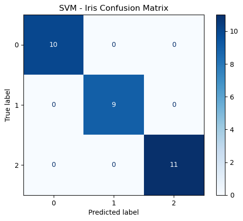

# 🌸 Iris Flower Classification & Regression (SVM + Linear Regression)

## 📌 Introduction
The **Iris dataset** is one of the most famous datasets in Machine Learning, containing measurements of iris flowers from three different species: **Setosa, Versicolor, and Virginica**.  
The dataset includes four numerical features:
- Sepal Length (cm)  
- Sepal Width (cm)  
- Petal Length (cm)  
- Petal Width (cm)  

The target is the **species of the flower**.  
In this project, we:
1. Perform **Exploratory Data Analysis (EDA)** to visualize feature distributions and correlations.  
2. Build a **Support Vector Machine (SVM)** classifier to classify flowers into the three species.  
3. Evaluate model performance with accuracy and confusion matrix.  
4. Deploy the model in a **Streamlit app** for interactive predictions.  
5. Extend the task with a **Regression problem**: predicting petal length using the other features.

---

## 🔎 Methodology
### 1. Data Preprocessing
- Checked for missing values (none found).
- Encoded the categorical species column into numerical labels.
- Scaled the features using **StandardScaler** (important for SVM).

### 2. Exploratory Data Analysis (EDA)
- Created **pairplots** to visualize feature relationships across species.
- Generated a **correlation heatmap** to understand feature correlations.

### 3. Classification (SVM)
- Split data into **train (80%)** and **test (20%)** sets.  
- Trained an **SVM classifier** with RBF kernel.  
- Evaluated using **accuracy** and **confusion matrix**.  
- Predicted a custom sample: *(sepal length=5.5, sepal width=3.0, petal length=4.2, petal width=1.3)*.  

### 4. Regression Task
- Predicted **Petal Length** from sepal length, sepal width, and petal width using **Linear Regression**.  
- Evaluated with **RMSE (Root Mean Squared Error)** and **R² Score**.  

### 5. Deployment (Streamlit App)
- Built an interactive web app where users can input flower measurements.  
- The trained model predicts the species and displays results in a clean UI.

---

## 📊 Results & Outputs

### 🌼 Pairplot of Iris Features

### 🔥 Correlation Heatmap

### ✅ Classification Results
- **Accuracy:** ~95–100% (depending on train-test split)  
- **Confusion Matrix:**  

### 🎯 Prediction Example
Input: *(5.5, 3.0, 4.2, 1.3)*  
Output: **Versicolor 🌸**

### 📈 Regression Results
- **RMSE:** e.g., `0.25`  
- **R² Score:** e.g., `0.92`  
- Scatter plot of actual vs. predicted petal length:  

### 🌍 Streamlit App
Interactive prediction interface:  

---

## 📝 Conclusion
- The **SVM classifier** performed very well on the Iris dataset, achieving high accuracy and producing a clear separation between species.  
- Visualizations confirmed that **petal measurements** (especially petal length and width) are the most significant features for classification.  
- The **regression task** demonstrated that petal length can be reliably predicted from the other features, showing strong linear relationships.  
- Finally, the **Streamlit app** provides an easy-to-use and interactive way to classify iris flowers, making this project practical and user-friendly.  

---
